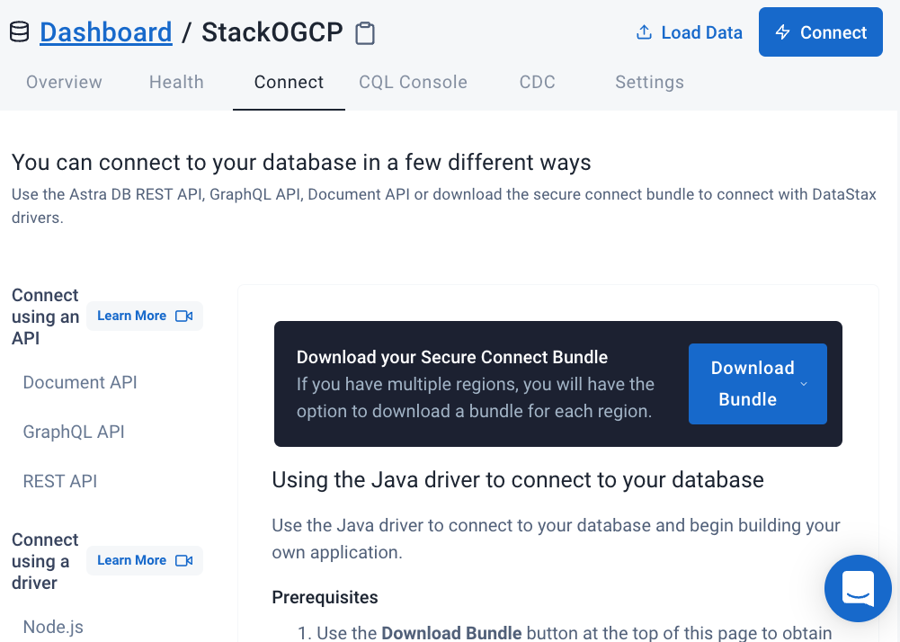

# 🎓 Graph Streaming with Astra and Quine

Welcome to the real-time graph ETL for modern data pipelines with **Quine and Apache Cassandra** workshop! In this two-hour workshop, we show how to combine a scalable database, `Apache Cassandra™`, with a powerful real-time streaming graph processor, `Quine`.

⏲️ **Duration :** 2 hours

🎓 **Level :** Intermediate


Using **Astra DB**, the cloud-based _Cassandra-as-a-Service_ platform delivered by DataStax, we will cover the very first steps for every developer who wants to try to learn a new database: creating tables and CRUD operations.

Quine, from the team at thatDot, is a real-time streaming graph interpreter. A server-side program that consumes data, builds a graph structure, and runs live computation on that graph to answer questions or compute results, and then stream them out.

It doesn't matter if you join our workshop live or you prefer to do it at your own pace, we have you covered. In this repository, you'll find everything you need for this workshop:

> [🔖 Accessing HANDS-ON](#-start-hands-on)

## 📋 Table of contents

- [🎓 Graph Streaming with Astra and Quine](#-graph-streaming-with-astra-and-quine)
  - [📋 Table of contents](#-table-of-contents)
  - [Objectives](#objectives)
  - [Frequently asked questions](#frequently-asked-questions)
  - [Materials for the Session](#materials-for-the-session)
- [🏁 Start Hands-on](#-start-hands-on)
  - [Create your Astra DB instance](#create-your-astra-db-instance)
    - [Download the SCB from the Astra dashboard](#download-the-scb-from-the-astra-dashboard)
      - [Cloud Region](#cloud-region)
      - [Token](#token)
      - [SCB](#scb)
  - [Setup Quine](#setup-quine)
    - [Download Quine](#download-quine)
    - [Configure Quine](#configure-quine)
      - [Astra-Specific Settings:](#astra-specific-settings)
    - [Download the recipe and sample data](#download-the-recipe-and-sample-data)
    - [Starting Quine](#starting-quine)
  - [Graph Exploration](#graph-exploration)
  - [Homework](#homework)
  - [What's NEXT ?](#whats-next-)
<p><br/>

## Objectives

1️⃣ **Give you an understanding of Quine streaming graph**

2️⃣ **Show how to configure Quine to use Cassandra or Astra DB**

3️⃣ **Provide an overview of Quine's Architecture**

4️⃣ **Have you run a streaming scenario to detect an anomaly in the graph**

🚀 **Have fun with an interactive session!**

## Frequently asked questions

<p/>
<details>
<summary><b> 1️⃣ Can I run this workshop on my computer?</b></summary>
<hr>
<p>There is nothing preventing you from running the workshop on your own machine. If you do so, you will need the following installed on your local system:
<ol>
<li><b>git</b>
<li><b>Java 11</b>
</ol>
</p>
In this readme, we try to provide instructions for local development as well - but keep in mind that the main focus is development on Gitpod, hence <strong>we can't guarantee live support</strong> about local development in order to keep on track with the schedule. However, we will do our best to give you the info you need to succeed.
</details>
<p/>
<details>
<summary><b> 2️⃣ What other prerequisites are required?</b></summary>
<hr>
<ul>
<li>You will need enough *real estate* on screen, we will ask you to open a few windows and it would not fit on mobiles (tablets should be OK)
<li>You will need an Astra account: don't worry, we'll work through that in the following
<li>As "Intermediate level" we expect you to know what Java is.  If you don't know what a streaming graph is, or haven't used a graph system before, that's ok...we'll cover that.
</ul>
</p>
</details>
<p/>
<details>
<summary><b> 3️⃣ Do I need to pay for anything for this workshop?</b></summary>
<hr>
<b>No.</b> All tools and services we provide here are FREE. FREE not only during the session but also after.
</details>
<p/>
<details>
<summary><b> 4️⃣ Will I get a certificate or badge if I attend this workshop?</b></summary>
<hr>
Attending the session is not enough. You need to complete the homework detailed below and you will get a nice badge that you can share on LinkedIn or anywhere else *(open badge specification)*
</details>
<p/>

## Materials for the Session

It doesn't matter if you join our workshop live or you prefer to work at your own pace,
we have you covered. In this repository, you'll find everything you need for this workshop:

- [Slide deck](/slides/slides.pdf)
- [Discord chat](https://dtsx.io/discord)
- [Questions and Answers](https://stackoverflow.com/questions/tagged/cassandra/)
- [Twitch backup](https://www.twitch.tv/datastaxdevs)

----

# 🏁 Start Hands-on

## Create your Astra DB instance

_**`ASTRA DB`** is the simplest way to run Cassandra with zero operations at all - just push the button and get your cluster. No credit card required, 40M read/write operations and about 80GB storage monthly for free - sufficient to run small production workloads. If you end your credits the databases will pause, no charge_

Leveraging the [database creation guide](https://awesome-astra.github.io/docs/pages/astra/create-instance/#c-procedure), create a database. *Right-Click the button* with *Open in a new TAB.*

<a href="https://astra.dev/2-16"></a>

|Field|Value|
|---|---|
|**Database Name**| `workshops`|
|**Keyspace Name**| `quine`|
|**Regions**| Select `GOOGLE CLOUD`, then an Area close to you, then a region with no LOCKER 🔒 icons, those are the region you can use for free.   |

> **ℹ️ Note:** If you already have a database `workshops`, simply add a keyspace `quine` using the `Add Keyspace` button on the bottom right hand corner of db dashboard page.

While the database is being created, you will also get a **Security token**:
save it somewhere safe, as it will be needed to later in others workshop (In particular the string starting with `AstraCS:...`.)

The status will change from `Pending` to `Active` when the database is ready, this will only take 2-3 minutes. You will also receive an email when it is ready.

### Download the SCB from the Astra dashboard

To connect Quine (and other applications) with Astra DB, you will need a few points of data.  Most importantly you'll need to note your cloud region and token, as well as to download the secure connect bundle (SCB).



#### Cloud Region

#### Token

#### SCB

[🏠 Back to Table of Contents](#-table-of-content)

## Setup Quine

These instructions were written using Java 11.10.  To run Quine locally, follow the steps below.  Or, you can run it in GitPod:

[](https://gitpod.io/#https://github.com/datastaxdevs/workshop-streaming-graph-quine)

### Download Quine

Follow the [Download Quine page](https://quine.io/download) to download the JAR. Choose/create a directory for Quine, and copy the JAR to another location:

```bash
mkdir ~/local/quine
cp ~/Downloads/quine-1.3.2.jar ~/local/quine/
```

### Configure Quine

Create a `quine.conf` file inside the quine directory:

```bash
cd ~/local/quine
touch quine.conf
```

Edit the `quine.conf` file:

```json
quine.store {
  # store data in an Apache Cassandra instance
  type = cassandra
  # the keyspace to use
  keyspace = quine
  should-create-keyspace = false
  should-create-tables = true
  replication-factor = 3
  write-consistency = LOCAL_QUORUM
  read-consistency = LOCAL_QUORUM
  local-datacenter = "us-east1"
  write-timeout = "10s"
  read-timeout = "10s"
}
datastax-java-driver {
  advanced {
    auth-provider {
      class = PlainTextAuthProvider
      username = "token"
      password = "AstraCS:qFDPGZEgBlahBlahYourTokenGoesHerecff15fc"
    }
  }
  basic {
    cloud {
      secure-connect-bundle = "/Users/aaronploetz/local/secure-connect-quine.zip"
    }
  }
}
```

#### Astra-Specific Settings:

`type = cassandra` - If the type is not specified, Quine defaults to use RocksDB.

`should-create-keyspace = false` - Remember keyspaces can only be created in Astra via the dashboard.

`replication-factor = 3` - Defaults to 1 if not set, which will not work with Astra DB.

`write-consistency = LOCAL_QUORUM` - Minimum consistency level required by Astra.

`read-consistency = LOCAL_QUORUM` - Minimum consistency level required by Astra.

`local-datacenter = "us-east1"` - Set your Astra DB cloud region as the local DC.

`username = "token"` - No need to mess with this. Just leave it as the literal word "token."

`password` - A valid token for an Astra DB cluster.

`secure-connect-bundle` - A valid, local file location of a downloaded Astra secure connect bundle. The driver gets the Astra DB hostname from the secure bundle, so there is no need to specify endpoints separately.

### Download the recipe and sample data

Download the "Password Spraying" [recipe](https://raw.githubusercontent.com/datastaxdevs/workshop-streaming-graph-quine/main/password-spraying-workshop.yml) from Github. Move the resulting YAML file to your `quine` directory.

```bash
mkdir ~/local/quine
cp password-spraying-workshop.yml ~/local/quine/
```

Then, download the [sample data file](https://that.re/attempts)" and move the JSON file to your `quine` directory.

```bash
mkdir ~/local/quine
cp attempts.json ~/local/quine/
```
### Starting Quine

To run Quine using the Password Spray recipe, invoke the JAR with Java, while passing the `quine.conf` as a `config.file` JVM parameter, while also specifying the recipe, like this:

```bash
cd ~/local/quine
java -Dconfig.file=quine.conf -jar quine-1.3.2.jar -r password-spraying-workshop.yml --force-config
```

If Quine starts correctly, it should produce output similar to below:
```bash
2022-06-15 15:11:52,666 WARN [NotFromActor] [s0-io-4] com.datastax.oss.driver.internal.core.cql.CqlRequestHandler - Query '[0 values] CREATE TABLE IF NOT EXISTS journals (quine_id blob,timestamp bigint,data blob,PRIMARY KEY(quine_id,timestamp)) WITH CLUSTERING ORDER BY (timestamp ASC) AND compaction={'class':'TimeWindowCompactionStrategy'}' generated server side warning(s): Ignoring provided values [compaction] as they are not supported for Table Properties (ignored values are: [additional_write_policy, bloom_filter_fp_chance, caching, cdc, compaction, compression, crc_check_chance, dclocal_read_repair_chance, extensions, gc_grace_seconds, id, max_index_interval, memtable_flush_period_in_ms, min_index_interval, nodesync, read_repair, read_repair_chance, speculative_retry])
Graph is ready!
Application state loaded.
Quine app web server available at http://0.0.0.0:8080
```

Quine should then start ingesting the data stream automatically, displaying its progress as it moves along.

If the output does not read: 

```
Graph is ready!
Application state loaded.
Quine app web server available at http://locahost:8080
```

Then look for exceptions.

If you see an error:

```
com.datastax.oss.driver.api.core.servererrors.InvalidQueryException: Clustering key columns must exactly match columns in CLUSTERING ORDER BY directive
```

Check to ensure the snapshots table exists:

```
cqlsh> use quine;
cqlsh> desc quine;
```

If not, execute this command in CQLSH to create it:

```
CREATE TABLE quine.snapshots (
    quine_id blob,
    timestamp bigint,
    multipart_index int,
    data blob,
    multipart_count int,
    PRIMARY KEY (quine_id, timestamp, multipart_index)
) WITH CLUSTERING ORDER BY (timestamp DESC, multipart_index ASC)
    AND additional_write_policy = '99PERCENTILE'
    AND bloom_filter_fp_chance = 0.01
    AND caching = {'keys': 'ALL', 'rows_per_partition': 'NONE'}
    AND comment = ''
    AND compaction = {'class': 'org.apache.cassandra.db.compaction.UnifiedCompactionStrategy'}
    AND compression = {'chunk_length_in_kb': '64', 'class': 'org.apache.cassandra.io.compress.LZ4Compressor'}
    AND crc_check_chance = 1.0
    AND default_time_to_live = 0
    AND gc_grace_seconds = 864000
    AND max_index_interval = 2048
    AND memtable_flush_period_in_ms = 0
    AND min_index_interval = 128
    AND read_repair = 'BLOCKING'
    AND speculative_retry = '99PERCENTILE';
```

You can now use Quine's visual graph explorer in a web browser, and create/traverse data with either Gremlin or Cypher: http://localhost:8080/

[🏠 Back to Table of Contents](#table-of-contents)

## Graph Exploration

```
todo
```

## Homework

To submit the **homework**,

```
todo
```

## What's NEXT ?

We've just scratched the surface of what you can do using Astra DB, built on Apache Cassandra.
Go take a look at [DataStax for Developers](https://www.datastax.com/dev) to see what else is possible.
There's plenty to dig into!

Congratulations: you made to the end of today's workshop.

**... and see you at our next workshop!**

> Sincerely yours, The DataStax Developers
